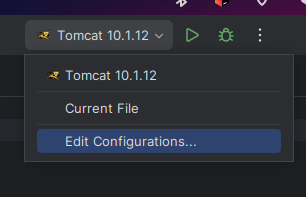
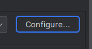
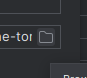

# Четвёртое задание курса [java-backend-learning-course](https://zhukovsd.github.io/java-backend-learning-course/)

[](https://github.com/farneser/tennis-scoreboard/actions/workflows/maven.yml)

[Ревью за 21.09.2023](review.md)

## [Задание](https://zhukovsd.github.io/java-backend-learning-course/Projects/TennisScoreboard/)

Веб-приложение, реализующее табло счёта теннисного матча.

## Запуск локально

### Использование Intellij Idea

1. Открытие меню конфигураций



2. По стандарту присутствует только одна конфигурация и она сразу будет выбрана, нажимаем конфигурировать Tomcat сервер



3. Выбираем путь до своего Tomcat сервера и сохраняем и запускаем



## Список задач после ревью (помечены "❗" в [ревью](review.md))

MatchesService:

- ✓ public MatchListViewModel persist(MatchesDto matchesDto) - по названию метода и аргументу, я бы подумал, что он
  отвечает за сохранение списка матчей в БД. По факту, он занимается чтением матчей. Необходимо, чтобы название
  совпадало со смыслом метода - public MatchListViewModel findMatch(findMatchesDto matchesDto)

- ✓ Класс HashMap, используемый для хранения текущих матчей, не является потокобезопасным. Необходимо либо защитить
  хешмапу от одновременного доступа, добавив synchronized на методы create, get, либо вместо HashMap взять
  ConcurrectHashMap.

Hibernate

- Исключения от Hibernate проглатываются, плохая практика

## Что нужно знать

- [Java](https://github.com/zhukovsd/java-backend-learning-course/Technologies/Java/) - коллекции, ООП
- [Maven/Gradle](https://github.com/zhukovsd/java-backend-learning-course/Technologies/BuildSystems/)
- [Backend](https://github.com/zhukovsd/java-backend-learning-course/Technologies/Backend/)
    - Java сервлеты
    - HTTP - GET и POST запросы, коды ответа
    - REST API, JSON
- [Базы данных](https://github.com/zhukovsd/java-backend-learning-course/Technologies/Databases/) - SQL, JDBC, H2
  [Frontend](https://zhukovsd.github.io/java-backend-learning-course/Technologies/Frontend/) - HTML/CSS, блочная вёрстка
- [Тесты](https://zhukovsd.github.io/java-backend-learning-course/Technologies/Tests/) - юнит тестирование, JUnit 5
- [Деплой](https://github.com/zhukovsd/java-backend-learning-course/Technologies/DevOps/#деплой) - облачный хостинг,
  командная строка Linux, Tomcat

## Мотивация проекта

- Создать клиент-серверное приложение с веб-интерфейсом
- Получить практический опыт работы с ORM Hibernate
- Сверстать простой веб-интерфейс без сторонних библиотек
- Познакомиться с архитектурным паттерном MVC(S)

### Комментарии:

- Проект не подразумевает фреймворки, ради практики с паттерном MVC, Spring Boot начнется с проекта #6
- Не используем Bootstrap, для практики верстки вручную, Bootstrap можно будет использовать в проекте #5
- Проект не многопользовательский, поэтому не используем сессии

## Сборка

### Загрузка зависимостей

```bash
./mvnw install
```

### Сборка war артефакта

```bash
./mvnw war:war
```

### Запуск тестов

```bash
./mvnw test 
```

## Функционал приложения

Работа с матчами:

- Создание нового матча
- Просмотр законченных матчей, поиск матчей по именам игроков
- Подсчёт очков в текущем матче

## Подсчёт очков в теннисном матче

В теннисе особая система подсчёта очков - https://www.gotennis.ru/read/world_of_tennis/pravila.html

Для упрощения, допустим что каждый матч играется по следующим правилам:

- Матч играется до двух сетов (best of 3)
- При счёте 6/6 в сете, играется тай-брейк до 7 очков

## База данных

В качестве базы данных предлагаю использовать H2. Это in-memory SQL база для Java. In-memory означает то, что движок БД
и сами таблицы существуют только внутри памяти Java приложения. При использовании in-memory хранилища необходимо
инициализировать таблицы базы данных при каждом старте приложения.

#### Таблица `Players` - игроки

| Имя колонки | Тип     | Комментарий                   |
|-------------|---------|-------------------------------|
| ID          | Int     | Первичный ключ, автоинкремент |
| Name        | Varchar | Имя игрока                    |

Индексы:

- Индекс колонки `Name`, для эффективности поиска игроков по имени

### Таблица `Matches` - завершенные матчи

Для упрощения, в БД сохраняются только доигранные матчи в момент их завершения.

| Имя колонки | Тип | Комментарий                                     |
|-------------|-----|-------------------------------------------------|
| ID          | Int | Первичный ключ, автоинкремент                   |
| Player1     | Int | Айди первого игрока, внешний ключ на Players.ID |
| Player2     | Int | Айди второго игрока, внешний ключ на Players.ID |
| Winner      | Int | Айди победителя, внешний ключ на Players.ID     |

## MVCS

MVCS - архитектурный паттерн, особенно хорошо подходящий под реализацию подобных приложений. Я подразумеваю, что студент
самостоятельно изучил что такое MVCS, и ниже приведу только пример того, как он может быть использован в данном проекте.

### Учёт счёта матча

Пример (именование классов и сервисов на мой вкус):

`MatchScoreController`:

- Обрабатывает POST запросы к `/match-score`
- Через `OngoingMatchesService` получает экземпляр класса `Match` для текущего матча, который является моделью/частью
  модели `MatchScoreModel`
- Через `MatchScoreCalculationService` обновляет счёт в матче
- Если матч закончился - через `FinishedMatchesPersistenceService` сохраняет законченный матч в базу данных
- С помощью `MatchScoreView` отображает `MatchScoreModel` в виде отрендеренного HTML

Каждый из упомянутых сервисов делает конкретную работу:

- `OngoingMatchesService` хранит текущие матчи и позволяет их записывать/читать
- `MatchScoreCalculationService` реализует логику подсчёта счёта матча по очкам/геймам/сетам
- `FinishedMatchesPersistenceService` инкапсулирует чтение и запись законченных матчей в БД

## Тесты

Покроем юнит тестами подсчёт очков в матче. Примеры кейсов:

- Если игрок 1 выигрывает очко при счёте 40-40, гейм не заканчивается
- Если игрок 1 выигрывает очко при счёте 40-0, то он выигрывает и гейм
- При счёте 6-6 начинается тайбрейк вместо обычного гейма

Предлагаю студентам самостоятельно придумать тест кейсы для покрытия всех вариантов изменения счёта в матче, особенно
правила "больше-меньше" и тайбрейк. Набор тестов должен быть реализован с помощью JUnit 5.

## Деплой

Будем вручную деплоить war артефакт в Tomcat, установленный на удалённом сервере. При использовании базы данных H2,
установка внешней SQL БД не требуется.

Шаги:

- Локально собрать war артефакт приложения
- В хостинг-провайдере по выбору арендовать облачный сервер на Linux
- Установить JRE и Tomcat
- Зайти в админский интерфейс Tomcat, установить собранный war артефакт

Ожидаемый результат - приложение доступно по адресу `http://$server_ip:8080/tennis_scoreboard_war`.

## План работы над приложением

- Классы-модели Hibernate для таблиц БД
- Страница создания нового матча
- Сервисы для хранения текущих матчей и подсчета очков в матче, юнит тесты для подсчёта очков
- Страница счёта матча
- Сервис для сохранения законченного матча в БД
- Сервис поиска законченных матчей по имени игрока
- Страница отображения законченных матчей, поиска матчей по имени игрока
- Деплой на удалённый сервер